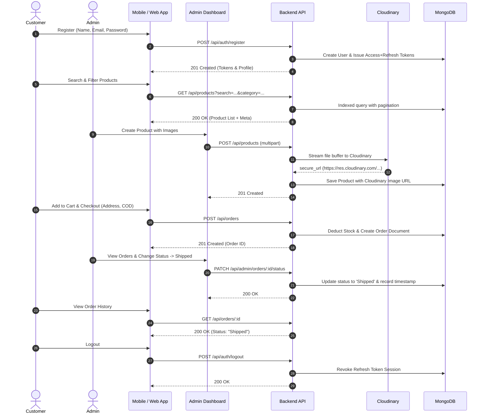

# 🛒 Full-Stack E-Commerce Platform (NovaStore)

A production-grade, full-stack E-Commerce ecosystem featuring a **Node.js/Express & MongoDB REST API backend**, a modern **React + Vite Admin Dashboard**, and a cross-platform **Flutter Mobile Application** for customers.

---

## 📑 Table of Contents
1. [Overview](#-overview)
2. [Tech Stack](#-tech-stack)
3. [Folder Structure](#-folder-structure)
4. [Architecture & Security Strategy](#-architecture--security-strategy)
   - [Access & Refresh Token Strategy (Rotation & Family Revocation)](#access--refresh-token-strategy)
   - [Mobile Secure Storage (`flutter_secure_storage`)](#mobile-token-storage-strategy)
   - [Cloudinary & File Upload Architecture](#cloudinary--file-upload-architecture)
   - [Database Indexing Strategy](#database-indexing-strategy)
   - [Standardized Pagination Format](#standardized-pagination-format)
5. [Prerequisites & MongoDB Setup](#-prerequisites--mongodb-setup)
6. [Environment Variables](#-environment-variables)
7. [Installation & Setup](#-installation--setup)
8. [Seeded Test Credentials](#-seeded-test-credentials)
9. [How to Run Each Part](#-how-to-run-each-part)
10. [End-to-End User Flow](#-end-to-end-user-flow)
11. [Completed / Incomplete / Bonus Status](#-completed--incomplete--bonus-status)
12. [Known Limitations](#-known-limitations)

---

## 🌟 Overview

NovaStore provides a seamless end-to-end shopping experience:
- **Customers** can register, log in (email/password or Google OAuth), browse curated products with instant search/filter/sort, manage an active cart, place cash-on-delivery or online orders, view order histories in real-time, and update profiles with custom avatars.
- **Store Administrators** get a dedicated web portal with real-time sales/revenue metrics, complete inventory and product management (with multi-image upload via Cloudinary), category organization, customer management with instant session revocation upon deactivation, and full order lifecycle tracking.

---

## 🛠️ Tech Stack

### 1. Backend REST API
- **Runtime**: Node.js (>= 18.0.0) & Express.js
- **Database**: MongoDB with Mongoose ODM (Transactions, Indexes, Aggregation Pipelines)
- **Authentication**: JWT Access Tokens (short-lived, 15m) + Cryptographic Refresh Token Rotation (30d) in MongoDB + httpOnly cookies / Bearer headers
- **Cloud Storage**: Cloudinary SDK (v2) with direct memory stream buffer uploads
- **Security & Reliability**: Helmet, CORS with whitelist validation, Express Rate Limiter, Joi Schema Validation, Winston + Morgan Logging, centralized AppError handling

### 2. Admin Dashboard (Web)
- **Framework**: React 18 + Vite
- **Routing**: React Router v6
- **State Management**: Redux Toolkit (Slices for Auth, Products, Categories, Orders, Users, Analytics)
- **Styling**: Modern dark-themed CSS design with Glassmorphism, CSS variables, and Lucide React icons
- **Notifications**: React Hot Toast

### 3. Mobile Application (iOS & Android)
- **Framework**: Flutter 3.x (Dart 3.x)
- **State Management**: Flutter Riverpod 2.5 (NotifierProviders & AsyncNotifiers)
- **Networking**: Dio with automated token refresh interceptor and queue replay
- **Secure Persistence**: `flutter_secure_storage` (Android Keystore / iOS Keychain)
- **Navigation**: GoRouter 14.x with auth-redirect guards
- **UI Components**: Google Fonts (Plus Jakarta Sans), Shimmer skeleton loaders, Smooth Page Indicators, CachedNetworkImage

---

## 📂 Folder Structure

```text
E-Commerce Assignment/
├── backend/                        # Node.js + Express REST API
│   ├── src/
│   │   ├── config/                 # Environment, Database, Cloudinary & Logger setup
│   │   ├── controllers/            # Route controllers (Auth, Product, Order, User, Admin, Cart)
│   │   ├── middlewares/            # Auth, Admin guard, Joi validator, Multer memory upload, Error handling
│   │   ├── models/                 # Mongoose schemas (User, Product, Category, Order, Cart, RefreshToken)
│   │   ├── repositories/           # Data access layer for Mongoose models
│   │   ├── routes/                 # Express router declarations (/api/auth, /api/products, etc.)
│   │   ├── services/               # Core business logic, Cloudinary integrations & token rotation
│   │   ├── utils/                  # AppError, asyncHandler, cloudinaryHelper, queryBuilder, slugify
│   │   ├── validators/             # Joi input validation schemas
│   │   ├── app.js                  # Express app definition & middleware pipeline
│   │   └── server.js               # HTTP server bootstrap & graceful shutdown hooks
│   ├── scripts/
│   │   └── seed.js                 # Realistic database seeder
│   ├── uploads/                    # Local storage fallback directory (.gitkeep preserved)
│   ├── .env.example                # Backend environment template (safe placeholders)
│   └── package.json
│
├── admin/                          # React + Vite Admin Portal
│   ├── src/
│   │   ├── api/                    # Axios instance with auto-refresh interceptor
│   │   ├── components/             # Reusable UI components (Modals, StatCards, Tables, Spinners)
│   │   ├── layouts/                # Admin sidebar, header, and dashboard shell
│   │   ├── pages/                  # Dashboard, Products, ProductForm, Categories, Orders, Users, Login
│   │   ├── store/                  # Redux Toolkit slices and root store
│   │   ├── constants/              # Order status mappings, sort options, API URLs
│   │   ├── index.css               # Global dark glassmorphism design system
│   │   └── main.jsx
│   ├── .env.example                # Admin environment template
│   └── package.json
│
├── mobile/                         # Flutter Mobile App
│   ├── lib/
│   │   ├── api/                    # Dio client with automatic 401 token refresh queue
│   │   ├── constants/              # App colors, themes, API endpoints
│   │   ├── models/                 # Dart data classes (User, Product, Category, Order, Cart)
│   │   ├── navigation/             # GoRouter configuration & route guards
│   │   ├── providers/              # Riverpod state providers (Auth, Cart, Products, Orders)
│   │   ├── screens/                # Mobile views (Auth, Home, Products, Details, Cart, Checkout, Orders, Profile)
│   │   ├── services/               # StorageService (`flutter_secure_storage`), AuthService
│   │   └── widgets/                # ProductCards, CategoryPills, LoadingShimmers, Badges
│   ├── .env.example                # Mobile environment template
│   └── pubspec.yaml
│
├── package.json                    # Workspace helper scripts
└── README.md                       # Master Documentation
```

---

## 🔒 Architecture & Security Strategy

### Access & Refresh Token Strategy
The backend implements **Cryptographic Refresh Token Rotation with Token Family Reuse Detection**:
1. **Short-Lived Access Token**: Signed with `JWT_ACCESS_SECRET` with a 15-minute expiration (`15m`).
2. **Refresh Token**: 64-byte cryptographically secure random token signed with `JWT_REFRESH_SECRET` and saved as a SHA-256 hash in MongoDB (`RefreshToken` collection) with a 30-day TTL index.
3. **Token Rotation**: Every call to `POST /api/auth/refresh` issues a brand-new access token AND a new refresh token. The old refresh token is marked as `isUsed: true`.
4. **Token Family Reuse Detection**: If a previously used refresh token is presented again (indicating token theft or replay), the system immediately revokes the **entire token family** and logs a security warning, preventing further unauthorized access.
5. **Session Revocation**:
   - Explicit logout (`POST /api/auth/logout`) invalidates the refresh token session.
   - User deactivation by an admin (`PATCH /api/admin/users/:id/status`) revokes all active refresh tokens for that account immediately.

### Mobile Token-Storage Strategy
- Uses **`flutter_secure_storage`**:
  - **Android**: Stores sensitive access and refresh tokens in Android Keystore with AES encryption.
  - **iOS**: Stores credentials securely in the iOS Keychain.
- **Dio Interceptor**: Automatically attaches `Bearer <access_token>` to outgoing requests. If a request returns `401 Unauthorized`, the interceptor automatically pauses pending requests, calls `POST /api/auth/refresh`, persists the new tokens to secure storage, and retries the original request seamlessly.

### Cloudinary & File Upload Architecture
- In-memory Multer storage (`multer.memoryStorage()`) receives incoming multipart files without writing unneeded temporary files to the local disk.
- [cloudinaryHelper.js](file:///c:/Users/Acer/OneDrive/Desktop/E-Commerce%20Assignment/backend/src/utils/cloudinaryHelper.js) streams buffers directly to Cloudinary:
  - **Products**: Stored under `ecommerce/products` (supports up to 5 images per product).
  - **Categories**: Stored under `ecommerce/categories`.
  - **Avatars**: Stored under `ecommerce/users` with automatic facial centering (`crop: fill, gravity: face`).
- Updating or deleting products, categories, or avatars automatically extracts the Cloudinary `public_id` and destroys old assets to prevent storage bloat.

### Database Indexing Strategy
Optimized MongoDB indexes ensure high performance and sub-millisecond query execution:
- **Products**:
  - `slug`: Unique index for fast URL-safe lookups.
  - `category + isActive + createdAt`: Compound index for categorized catalog filtering and sorting.
  - `name + description`: Full-text search index (`$text`) with weighted relevancy.
  - `isFeatured + isActive`: Compound index for homepage showcase queries.
  - `price`: Ascending/descending indexing for price range filtering.
- **Orders**:
  - `user + createdAt`: Compound index for customer order history.
  - `orderNumber`: Unique index for tracking lookups.
  - `status + createdAt`: Compound index for admin filtering.
- **RefreshTokens**:
  - `tokenHash`: Unique index for fast verification.
  - `expiresAt`: TTL index for automatic expiration cleanup by MongoDB.
  - `userId + tokenFamily`: Compound index for family revocation.

### Standardized Pagination Format
All list endpoints return a consistent, uniform structure:

```json
{
  "success": true,
  "data": {
    "products": [ /* items */ ]
  },
  "meta": {
    "total": 48,
    "page": 1,
    "limit": 10,
    "totalPages": 5,
    "hasNextPage": true,
    "hasPrevPage": false
  }
}
```

---

## ⚙️ Prerequisites & MongoDB Setup

### Prerequisites
- **Node.js**: v18.0.0 or higher
- **npm**: v9.0.0 or higher
- **Flutter SDK**: v3.19.0 or higher (for mobile)
- **MongoDB**: Local MongoDB instance (`mongodb://localhost:27017`) or **MongoDB Atlas** connection URI

---

## 🔑 Environment Variables

### 1. Backend (`backend/.env`)
Create `backend/.env` copying from `backend/.env.example`:

```env
NODE_ENV=development
PORT=5000

# MongoDB Connection
MONGO_URI=mongodb://localhost:27017/ecommerce
# or Atlas URI: mongodb+srv://<username>:<password>@cluster0.xxx.mongodb.net/ecommerce?retryWrites=true&w=majority

# JWT Secrets
JWT_ACCESS_SECRET=your_jwt_access_secret_min_32_characters
JWT_REFRESH_SECRET=your_jwt_refresh_secret_min_32_characters
JWT_ACCESS_EXPIRES_IN=15m
JWT_REFRESH_EXPIRES_IN=30d

# Google OAuth (Optional)
GOOGLE_CLIENT_ID=your_google_client_id.apps.googleusercontent.com
GOOGLE_CLIENT_SECRET=your_google_client_secret

# URLs & CORS
CLIENT_URL=http://localhost:3000
ADMIN_URL=http://localhost:4000
PUBLIC_API_URL=http://localhost:5000

# File Uploads & Cloudinary
MAX_FILE_SIZE_MB=5
CLOUDINARY_CLOUD_NAME=your_cloud_name
CLOUDINARY_API_KEY=your_api_key
CLOUDINARY_API_SECRET=your_api_secret
CLOUDINARY_FOLDER=ecommerce

# Logging & Cookies
LOG_LEVEL=debug
COOKIE_SECURE=false
COOKIE_SAME_SITE=lax
```

### 2. Admin Portal (`admin/.env`)
Create `admin/.env` copying from `admin/.env.example`:

```env
VITE_API_URL=http://localhost:5000/api
```

### 3. Mobile App (`mobile/.env`)
Create `mobile/.env` copying from `mobile/.env.example`:

```env
# Android Emulator uses 10.0.2.2 to access host machine localhost
API_BASE_URL_ANDROID=http://10.0.2.2:5000/api
API_BASE_URL_WEB=http://localhost:5000/api
API_BASE_URL_DEFAULT=http://localhost:5000/api

GOOGLE_WEB_CLIENT_ID=your_google_web_client_id.apps.googleusercontent.com
GOOGLE_SERVER_CLIENT_ID=your_google_server_client_id.apps.googleusercontent.com

APP_NAME=NovaStore
CURRENCY_SYMBOL=₹
FREE_DELIVERY_THRESHOLD=500
DEFAULT_DELIVERY_FEE=50
```

---

## 🚀 Installation & Setup

From the project root:

```bash
# 1. Install root dependencies
npm install

# 2. Install backend dependencies
cd backend && npm install && cd ..

# 3. Install admin portal dependencies
cd admin && npm install && cd ..

# 4. Install mobile dependencies
cd mobile && flutter pub get && cd ..
```

---

## 👥 Seeded Test Credentials

To populate your database with initial categories, products, admin users, and customers:

```bash
# From the backend folder:
cd backend
npm run seed

# Or to reset and re-seed from scratch:
npm run seed:clear
```

### Ready-to-Use Accounts:
| Role | Email | Password | Details |
| :--- | :--- | :--- | :--- |
| **Super Admin** | `admin@ecommerce.dev` | `Admin@Password123` | Full administrative privileges, dashboard, inventory & user control |
| **Customer** | `alice@example.com` | `Customer@Password123` | Active customer with cart & orders |
| **Customer** | `bob@example.com` | `Customer@Password123` | Active customer |
| **Customer** | `charlie@example.com` | `Customer@Password123` | Active customer |
| **Inactive User** | `diana@example.com` | `Customer@Password123` | Deactivated user account for testing auth blocks |

---

## 💻 How to Run Each Part

### Run Backend API Server
```bash
cd backend
npm run dev
# Server starts at http://localhost:5000
# Health check: http://localhost:5000/health
```

### Run Admin Web Portal
```bash
cd admin
npm run dev
# Portal starts at http://localhost:4000 (or http://localhost:5173)
```

### Run Mobile App
```bash
cd mobile

# Run on Chrome / Web
flutter run -d chrome

# Run on connected Android device / emulator
flutter run -d android

# Run on connected iOS simulator / device
flutter run -d ios
```

---

## 🔄 End-to-End User Flow

The entire customer and administrative lifecycle is fully functional and verified:



---

## 📊 Completed / Incomplete / Bonus Status

### ✅ Completed Core Requirements
- [x] **Authentication & Authorization**: Registration, login, role-based access (customer & admin), short-lived JWT access tokens + rotating refresh tokens.
- [x] **Product Catalog**: Paginated product listing, category filtering, text search, price/name/rating sorting, slug generation.
- [x] **Product Management**: Full CRUD for products, multi-image upload via Cloudinary, image deletion on update/delete.
- [x] **Category Management**: Full CRUD for categories, hierarchy support, and image upload.
- [x] **Cart System**: Persistent customer cart in MongoDB, add/update/remove items, stock validation.
- [x] **Order Workflow**: Multi-item checkout, delivery address validation, order placement, order status transitions (`Pending` -> `Confirmed` -> `Shipped` -> `Delivered` -> `Cancelled`).
- [x] **Admin Operations**: Analytics overview (revenue, total orders, low-stock warnings), user management, active/inactive toggling.
- [x] **Mobile App**: Cross-platform Flutter UI, Riverpod state management, `flutter_secure_storage` integration, shimmer loading, responsive checkout flow.
- [x] **Security Hardening**: All `.env.example` templates cleaned of real secrets, `uploads/` gitignored with `.gitkeep` retained, no passwords or tokens exposed in log files.

### 🌟 Completed Bonus Features
- [x] **Cloudinary Integration**: Direct memory streaming buffer uploads with folder classification and automated face-detection transformations.
- [x] **Token Family Reuse Detection**: Automatic theft prevention that revokes full token families if an expired or stolen refresh token is replayed.
- [x] **Google OAuth 2.0 Integration**: Backend token verification & account linking.
- [x] **Graceful Shutdown**: Zero-downtime server termination with Mongoose connection draining.
- [x] **Robust Seed Engine**: Configurable seeder with realistic test data for instant testing.

### ⏳ Potential Future Enhancements
- [ ] Direct payment gateway webhook integration (Stripe / Razorpay live webhooks).
- [ ] Push notifications via Firebase Cloud Messaging (FCM) on order status updates.

---

## ⚠️ Known Limitations
1. **Google OAuth Client IDs**: In order to test Google Sign-In on mobile and web, valid `GOOGLE_CLIENT_ID` credentials from Google Cloud Console must be supplied in `.env`.
2. **MongoDB Replica Set for Transactions**: If running against a local standalone MongoDB instance without a replica set, the order placement service gracefully executes standard multi-document operations with fallback safeguards.
3. **Cloudinary Rate Limits**: Free-tier Cloudinary accounts are subject to monthly transformation credits.
