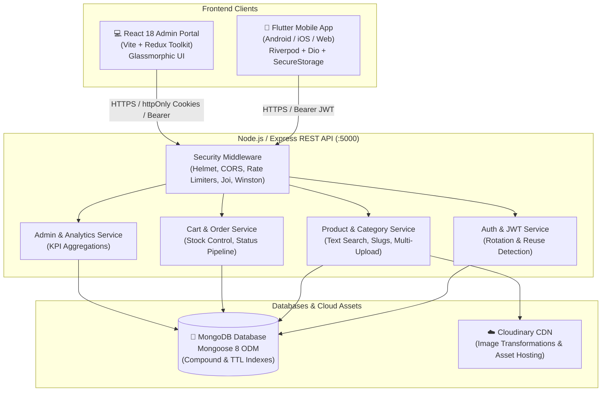
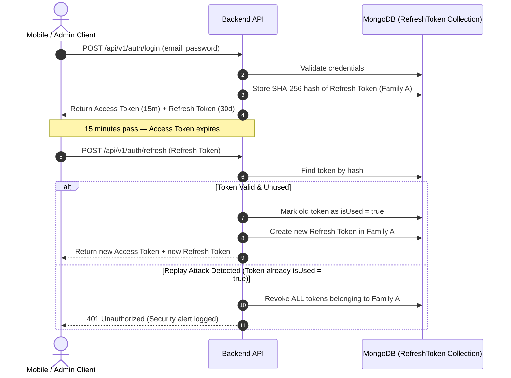

# 🛒 NovaStore — Full-Stack E-Commerce Platform

[](https://nodejs.org/)
[](https://expressjs.com/)
[](https://www.mongodb.com/)
[](https://react.dev/)
[](https://redux-toolkit.js.org/)
[](https://flutter.dev/)
[](https://riverpod.dev/)
[](https://cloudinary.com/)
[](https://render.com/)
[](https://opensource.org/licenses/MIT)

**NovaStore** is an enterprise-grade, full-stack E-Commerce platform built from scratch. It features a scalable **Node.js/Express & MongoDB REST API** (hosted on **Render Free Tier** with an automated keep-alive daemon), a high-performance **React + Vite Admin Portal** with dark-glassmorphism design, and a responsive **Flutter Mobile Application** for customers across Android, iOS, and Web.

---

## 📑 Table of Contents

1. [Architectural Overview](#-architectural-overview)
2. [Tech Stack Breakdown](#-tech-stack-breakdown)
3. [Monorepo Directory Structure](#-monorepo-directory-structure)
4. [Core Features & Functional Modules](#-core-features--functional-modules)
5. [Database Architecture & Indexing Strategy](#-database-architecture--indexing-strategy)
6. [Security & Token Management](#-security--token-management)
7. [Render Free Tier Hosting & Keep-Alive Mechanism](#-render-free-tier-hosting--keep-alive-mechanism)
8. [Prerequisites & System Requirements](#-prerequisites--system-requirements)
9. [Environment Variables Setup](#-environment-variables-setup)
10. [Step-by-Step Installation Guide](#-step-by-step-installation-guide)
11. [Database Seeding & Test Credentials](#-database-seeding--test-credentials)
12. [How to Run Each Service](#-how-to-run-each-service)
13. [Complete REST API Reference & Postman Workspace](#-complete-rest-api-reference)
14. [End-to-End Shopping & Order Flow](#-end-to-end-shopping--order-flow)
15. [Troubleshooting & Common Questions](#-troubleshooting--common-questions)
16. [Assignment Requirements Compliance Matrix](#-assignment-requirements-compliance-matrix)

---

## 🏗️ Architectural Overview

The platform uses a decoupled three-tier architecture:
- **Backend Core**: Express.js REST API providing stateless authentication, catalog search, cart sessions, transaction-safe order management, and administrative dashboards.
- **Admin Portal**: Single Page Application (SPA) built with React 18, Vite, and Redux Toolkit, providing real-time store metrics, inventory management with image uploads, and customer control.
- **Mobile Client**: Native/Cross-platform customer mobile application built with Flutter & Riverpod, featuring `flutter_secure_storage`, Dio automated token refresh, and instant cart/order flows.



---

## 🛠️ Tech Stack Breakdown

### 1. Backend REST API
- **Runtime**: Node.js (v18+) with Express.js 4.x
- **Hosting & Cloud Deployment**: **Render (Free Tier Web Service)** with automated self-health check keep-alive daemon
- **Database**: MongoDB with Mongoose 8.x
- **Authentication**: JWT (JSON Web Tokens) with cryptographically secure refresh token rotation & family revocation
- **Password Security**: bcrypt (12 salt rounds)
- **Validation**: Joi schema validation for all request parameters, bodies, and queries
- **Asset Storage**: Cloudinary SDK (v2) with memory stream buffer uploads (no temporary files left on disk)
- **Security**: Helmet HTTP header protection, strict CORS origin whitelisting, Express Rate Limit (customized per endpoint), cookie-parser
- **Logging**: Winston structured JSON logger (with sensitive data redaction) + Morgan HTTP request stream
- **Error Handling**: Centralized `AppError` class with standardized error response envelope
- **Keep-Alive Service**: Automated 2-minute interval ping service targeting `/health` to maintain instance activity and prevent cold starts

### 2. Admin Dashboard (Web)
- **Framework**: React 18 with Vite for lightning-fast HMR build times
- **State Management**: Redux Toolkit (`@reduxjs/toolkit` with slices for auth, products, categories, orders, users, and stats)
- **Routing**: React Router v6 with protected route guards and role-based redirects
- **Design System**: Modern Dark-Themed CSS design with Glassmorphism, CSS custom properties, and Lucide React icons
- **Feedback & Notifications**: React Hot Toast

### 3. Mobile Customer Application
- **Framework**: Flutter 3.19+ (Dart 3.x)
- **State Management**: Flutter Riverpod 2.5 (StateNotifierProviders & FutureProviders)
- **Networking**: Dio HTTP client with interceptors for automatic token refresh, request retries, and error handling
- **Secure Persistence**: `flutter_secure_storage` using Android Keystore (AES encryption) and iOS Keychain
- **Navigation**: GoRouter 14.x with declarative redirect guards
- **UI & UX**: Google Fonts (Plus Jakarta Sans), Shimmer skeleton loading animations, Smooth Page Indicators, CachedNetworkImage

---

## 📂 Monorepo Directory Structure

```text
NovaStore/
├── backend/                               # REST API Service
│   ├── logs/                              # Auto-generated application logs (gitignored)
│   ├── scripts/
│   │   └── seed.js                        # Development database seeder
│   ├── src/
│   │   ├── config/                        # Database, Environment, Cloudinary, and Logger configs
│   │   ├── controllers/                   # HTTP Request controllers (Auth, Products, Cart, Orders, Admin, Users)
│   │   ├── middlewares/                   # Auth (protect/requireAdmin), Joi validation, Multer, Error handler
│   │   ├── models/                        # Mongoose schemas (User, Product, Category, Cart, Order, RefreshToken)
│   │   ├── repositories/                  # Clean data access layer
│   │   ├── routes/                        # Express route definitions (/api/v1/* and /api/*)
│   │   ├── services/                      # Business logic, token rotation, and Cloudinary helpers
│   │   ├── utils/                         # AppError, asyncHandler, response envelope formatters
│   │   ├── validators/                    # Joi schemas for input validation
│   │   ├── app.js                         # Express application setup
│   │   └── server.js                      # HTTP server bootstrap & graceful shutdown hooks
│   ├── uploads/                           # Local fallback storage (.gitkeep preserved)
│   ├── .env.example                       # Backend environment template (safe placeholders)
│   └── package.json
│
├── admin/                                 # React + Vite Admin Panel
│   ├── src/
│   │   ├── api/                           # Axios instance with refresh interceptor
│   │   ├── components/                    # Modal dialogs, StatCards, Datatables, Badges, Loaders
│   │   ├── layouts/                       # AdminLayout (Sidebar, Navigation Header, Content shell)
│   │   ├── pages/                         # Dashboard, ProductsList, ProductForm, Categories, Orders, Users, Login
│   │   ├── routes/                        # ProtectedRoute, AppRoutes
│   │   ├── store/                         # Redux store & feature slices
│   │   ├── index.css                      # Master glassmorphism dark-theme design tokens
│   │   └── main.jsx                       # React application entry point
│   ├── .env.example                       # Admin environment template
│   └── package.json
│
├── mobile/                                # Flutter Mobile Client
│   ├── lib/
│   │   ├── api/                           # Dio HTTP client, AuthInterceptor with refresh queue
│   │   ├── constants/                     # Colors, typography, spacing, API endpoints
│   │   ├── models/                        # Dart serialization models (User, Product, Category, Cart, Order)
│   │   ├── navigation/                    # GoRouter configuration & auth guards
│   │   ├── providers/                     # Riverpod state providers
│   │   ├── screens/
│   │   │   ├── auth/                      # Login, Register, Google OAuth screens
│   │   │   ├── cart/                      # CartScreen with real-time price summary
│   │   │   ├── checkout/                  # CheckoutScreen (Address form, COD/Online) & Confirmation
│   │   │   ├── home/                      # HomeScreen (Banners, Categories, Featured products)
│   │   │   ├── orders/                    # OrderHistoryScreen & OrderDetailsScreen
│   │   │   ├── products/                  # ProductListingScreen & ProductDetailsScreen
│   │   │   └── profile/                   # ProfileScreen with dark mode switch and avatar
│   │   ├── services/                      # StorageService (flutter_secure_storage) & API services
│   │   ├── widgets/                       # ProductCard, CategoryChip, CartBadge, ShimmerLoaders
│   │   └── main.dart                      # Flutter app runner & ProviderScope
│   ├── .env.example                       # Mobile environment template
│   ├── pubspec.yaml                       # Flutter dependencies
│   └── analysis_options.yaml
│
├── .gitignore                             # Root gitignore protecting all secrets and node_modules
├── package.json                           # Root scripts to run backend, admin, and seeder
└── README.md                              # Master Documentation
```

---

## 🌟 Core Features & Functional Modules

### 1. Authentication & Security
- **Email & Password**: Registration, login, and profile fetching with bcrypt hashing (12 rounds).
- **Google OAuth 2.0**: Backend token validation verifying Google ID tokens with automatic account creation and linking.
- **Dual-Token System**:
  - Short-lived Access Token (`15m` validity) passed as Bearer Authorization header.
  - Long-lived Refresh Token (`30d` validity) stored as SHA-256 hash in MongoDB.
- **Token Family Reuse Detection**: If a previously used refresh token is submitted, the system flags a potential theft attack and revokes all active refresh tokens in that family.
- **Immediate Session Invalidation**: Deactivating a user from the Admin Panel instantly purges all active refresh tokens for that account.

### 2. Product Catalog & Inventory
- **Full Text Search**: Indexed MongoDB `$text` search on product title and description.
- **Faceted Filters**: Filter by category, price range (`minPrice`, `maxPrice`), featured status (`isFeatured`), and in-stock items (`inStock`).
- **Flexible Sorting**: Sort by price ascending/descending (`price:asc`, `price:desc`), newest (`createdAt:desc`), or customer rating.
- **Uniform Pagination**: Metadata returns `page`, `limit`, `total`, `totalPages`, `hasNextPage`, and `hasPrevPage`.
- **Automatic SEO Slugs**: Unique URL slugs generated automatically on product creation and updates.

### 3. Cloudinary Multi-Image Management
- **Memory Streaming**: Files uploaded via Multer are streamed directly from RAM to Cloudinary using `upload_stream`.
- **Organized Cloud Folders**: Assets are cleanly routed to `ecommerce/products`, `ecommerce/categories`, or `ecommerce/users`.
- **Automated Face Centering**: User avatar uploads apply smart face-detection cropping (`crop: fill, gravity: face`).
- **Orphan Asset Cleanup**: Updating or deleting a product/category destroys old Cloudinary assets by `public_id` to eliminate storage waste.

### 4. Shopping Cart & Checkout
- **Server-Side Persistence**: Cart items are persisted in MongoDB so customers never lose their selections across devices.
- **Stock Validation**: Quantity increments are checked against real-time product inventory.
- **Dynamic Cost Breakdown**: Computes item subtotals, configurable delivery fees, free-delivery thresholds, and discounts.
- **Multi-Option Checkout**: Supports Cash on Delivery (COD) and Online Payment simulation with full delivery address capture.

### 5. Order Lifecycle & Tracking
- **Order State Machine**: Enforces valid status transitions:
  $$\text{Pending} \longrightarrow \text{Confirmed} \longrightarrow \text{Shipped} \longrightarrow \text{Delivered}$$
  $$\text{Pending / Confirmed} \longrightarrow \text{Cancelled}$$
- **Atomic Stock Management**: Decrements inventory stock upon order creation; replenishes stock if an order is cancelled.
- **Customer History**: Paginated listing of past orders with item snapshots, prices at purchase time, and delivery status timeline.

### 6. Admin Dashboard & Analytics
- **Live KPI Overview**: Real-time cards for Total Revenue, Total Orders, Active Users, and Low-Stock Warnings.
- **Status Distribution**: Breakdown of orders across Pending, Confirmed, Shipped, Delivered, and Cancelled.
- **Product & Category CRUD**: Modals for creating and updating products with multi-image previews and instant category toggling.
- **Customer Directory**: View customer profiles, order counts, and toggle account activation status.

---

## 🗄️ Database Architecture & Indexing Strategy

### Mongoose Models & Schemas

| Collection | Key Fields | Purpose |
| :--- | :--- | :--- |
| **`users`** | `name`, `email`, `password`, `role`, `avatar`, `phone`, `isActive`, `googleId` | Stores customers and administrators |
| **`products`** | `name`, `slug`, `description`, `price`, `discountPrice`, `category`, `stock`, `images[]`, `isFeatured`, `isActive` | Product catalog items |
| **`categories`**| `name`, `slug`, `description`, `image`, `isActive` | Product categorization hierarchy |
| **`carts`** | `userId`, `items: [{ product, quantity, price }]`, `updatedAt` | Active customer cart items |
| **`orders`** | `orderNumber`, `user`, `items[]`, `shippingAddress`, `paymentMethod`, `paymentStatus`, `status`, `totalAmount`, `statusHistory[]` | Customer orders and fulfillment lifecycle |
| **`refreshtokens`** | `userId`, `tokenHash`, `tokenFamily`, `isUsed`, `expiresAt` | Secure token rotation and session control |

### Database Indexing Strategy

To guarantee high throughput and sub-millisecond query latency:
- **`Product`**:
  - `slug`: Unique index for fast URL lookups.
  - `{ category: 1, isActive: 1, createdAt: -1 }`: Compound index for category listings.
  - `{ isFeatured: 1, isActive: 1 }`: Compound index for homepage featured items.
  - `$text`: Compound text search index on `{ name: 'text', description: 'text' }`.
  - `price`: Ascending/Descending index for price range filters.
- **`Order`**:
  - `orderNumber`: Unique index for rapid tracking.
  - `{ user: 1, createdAt: -1 }`: Compound index for customer order history.
  - `{ status: 1, createdAt: -1 }`: Compound index for admin order filtration.
- **`RefreshToken`**:
  - `tokenHash`: Unique index for fast session validation.
  - `expiresAt`: TTL (Time-To-Live) index enabling MongoDB to automatically purge expired tokens.
  - `{ userId: 1, tokenFamily: 1 }`: Compound index for instant token family revocation.

---

## 🔒 Security & Token Management

### Refresh Token Rotation Architecture



### Rate Limiting Configuration
- **Global API Rate Limit**: 200 requests per 15 minutes per IP.
- **Login Rate Limit**: 10 attempts per 15 minutes to prevent brute-force attacks.
- **Register Rate Limit**: 10 registrations per hour to prevent bot account creation.
- **Refresh Token Rate Limit**: 30 refreshes per 15 minutes.
- **Google OAuth Rate Limit**: 20 attempts per 15 minutes.

---

## ☁️ Render Free Tier Hosting & Keep-Alive Mechanism

The NovaStore backend REST API is hosted on the **Render Free Web Service Tier** ([render.com](https://render.com/)).

### Free Tier Behavior & Cold Start Consideration
- **Inactivity Spin-Down**: Free tier web services on Render automatically spin down (enter sleep mode) after **15 minutes of inbound traffic inactivity** to conserve cloud resources.
- **Cold Start Latency**: When a sleeping instance receives a new request from the mobile app or admin dashboard, Render spins up the container, taking **~30–50 seconds** for initial boot.

### Built-In Automated Keep-Alive Daemon (`healthPinger.service.js`)
To prevent unexpected cold starts during testing and live demonstrations, NovaStore includes an embedded **Auto Health Pinger** service:
- **Interval-Based Self-Polling**: Runs a lightweight background daemon that pings the server's own `/health` endpoint every **2 minutes (120,000 ms)**.
- **Dynamic URL Resolution**: Automatically detects Render's platform environment variable `RENDER_EXTERNAL_URL` (e.g. `https://your-service.onrender.com`), falling back to `PUBLIC_API_URL` or `localhost`.
- **Zero Log Overhead**: The `/health` route is excluded from HTTP access logging in Winston/Morgan to avoid polluting log streams.
- **Real-Time Diagnostics**: Inspect ping statistics (total pings, success rate, latency, and last ping timestamp) anytime via `GET /health`:

```json
{
  "success": true,
  "message": "Server is healthy",
  "timestamp": "2026-09-03T05:50:00.000Z",
  "uptime": 1245.8,
  "pinger": {
    "isActive": true,
    "intervalMs": 120000,
    "targetUrl": "https://novastore-api.onrender.com/health",
    "totalPings": 10,
    "successfulPings": 10,
    "failedPings": 0,
    "lastPingAt": "2026-09-03T05:48:00.000Z",
    "lastStatus": 200,
    "lastDurationMs": 142
  }
}
```

---

## ⚙️ Prerequisites & System Requirements

Ensure the following tools are installed on your machine:
- **Node.js**: `v18.0.0` or newer ([Download Node.js](https://nodejs.org/))
- **npm**: `v9.0.0` or newer
- **MongoDB**: Local MongoDB instance running on port 27017 or a **MongoDB Atlas** connection string
- **Flutter SDK**: `v3.19.0` or newer ([Install Flutter](https://docs.flutter.dev/get-started/install)) — *Required for mobile app*
- **Git**: For version control

---

## 🔑 Environment Variables Setup

### 1. Backend Configuration (`backend/.env`)
Create a file named `.env` inside the `backend/` directory copying from `backend/.env.example`:

```env
# Server
NODE_ENV=development
PORT=5000

# MongoDB Connection String (Local or Atlas)
MONGO_URI=mongodb://localhost:27017/ecommerce

# JWT Secrets (generate strong random hex strings)
JWT_ACCESS_SECRET=e7b8f9a0c1d2e3f4a5b6c7d8e9f0a1b2c3d4e5f6a7b8c9d0e1f2a3b4c5d6e7f8
JWT_REFRESH_SECRET=a1b2c3d4e5f6a7b8c9d0e1f2a3b4c5d6e7f8a9b0c1d2e3f4a5b6c7d8e9f0a1b2
JWT_ACCESS_EXPIRES_IN=15m
JWT_REFRESH_EXPIRES_IN=30d

# Google OAuth (Optional — leave empty if not testing Google Sign-In)
GOOGLE_CLIENT_ID=
GOOGLE_CLIENT_SECRET=

# Client URLs (CORS Whitelisting)
CLIENT_URL=http://localhost:3000
ADMIN_URL=http://localhost:4000
PUBLIC_API_URL=http://localhost:5000

# Cloudinary (Optional — falls back to local uploads if omitted)
MAX_FILE_SIZE_MB=5
CLOUDINARY_CLOUD_NAME=
CLOUDINARY_API_KEY=
CLOUDINARY_API_SECRET=
CLOUDINARY_FOLDER=ecommerce

# Logging & Cookie Security
LOG_LEVEL=debug
COOKIE_SECURE=false
COOKIE_SAME_SITE=lax

# Render Free Tier & Health Check Keep-Alive
AUTO_HEALTH_PING_ENABLED=true
HEALTH_PING_INTERVAL_MS=120000
RENDER_EXTERNAL_URL=
```

> [!TIP]
> To generate a secure 64-byte random secret for JWT, run this in your terminal:
> ```bash
> node -e "console.log(require('crypto').randomBytes(64).toString('hex'))"
> ```

---

### 2. Admin Portal Configuration (`admin/.env`)
Create `.env` inside the `admin/` directory copying from `admin/.env.example`:

```env
# Backend API base endpoint
VITE_API_URL=http://localhost:5000/api
```

---

### 3. Mobile App Configuration (`mobile/.env`)
Create `.env` inside the `mobile/` directory copying from `mobile/.env.example`:

```env
# Network base URLs
# Android Emulator uses 10.0.2.2 to connect to your computer's localhost
API_BASE_URL_ANDROID=http://10.0.2.2:5000
API_BASE_URL_WEB=http://localhost:5000
API_BASE_URL_DEFAULT=http://localhost:5000

# Google OAuth Client IDs (Optional)
GOOGLE_WEB_CLIENT_ID=
GOOGLE_SERVER_CLIENT_ID=

# App Settings
APP_NAME=NovaStore
CURRENCY_SYMBOL=₹
FREE_DELIVERY_THRESHOLD=500
DEFAULT_DELIVERY_FEE=50
```

---

## 🚀 Step-by-Step Installation Guide

Open your terminal in the project root directory:

```bash
# 1. Install root workspace dependencies
npm install

# 2. Install backend dependencies
cd backend
npm install
cd ..

# 3. Install admin portal dependencies
cd admin
npm install
cd ..

# 4. Install mobile application dependencies
cd mobile
flutter pub get
cd ..
```

---

## 👥 Database Seeding & Test Credentials

Populate your database with categories, high-resolution products, admin users, and customer accounts:

```bash
# Run seeder from root
npm run seed

# Or run directly from backend folder
cd backend
npm run seed

# To reset collections and re-seed fresh:
npm run seed:clear
```

### Pre-Configured Test Accounts

| Account Type | Email | Password | Role & Permissions |
| :--- | :--- | :--- | :--- |
| **Super Admin** | `admin@ecommerce.dev` | `Admin@Password123` | Full access to Admin Portal, dashboard metrics, inventory CRUD, and user management |
| **Customer** | `alice@example.com` | `Customer@Password123` | Active customer with pre-loaded cart and order history |
| **Customer** | `bob@example.com` | `Customer@Password123` | Active customer |
| **Customer** | `charlie@example.com` | `Customer@Password123` | Active customer |
| **Inactive User** | `diana@example.com` | `Customer@Password123` | Deactivated user account (used to test auth rejection) |

---

## 💻 How to Run Each Service

### 1. Start the Backend API Server
```bash
cd backend
npm run dev
```
- Server endpoint: `http://localhost:5000`
- Live Health Check: `http://localhost:5000/health`
- Root Welcome: `http://localhost:5000/`

### 2. Start the Admin Web Dashboard
```bash
cd admin
npm run dev
```
- Admin Dashboard URL: `http://localhost:4000` (or `http://localhost:5173`)
- Log in using `admin@ecommerce.dev` / `Admin@Password123`

### 3. Start the Mobile Customer App
```bash
cd mobile

# Option A: Run in Chrome Browser
flutter run -d chrome

# Option B: Run on Android Emulator / Physical Device
flutter run -d android

# Option C: Run on iOS Simulator (macOS only)
flutter run -d ios
```

---

## 📡 Complete REST API Reference

### 📮 Postman Collection & Environment Setup

A ready-to-use Postman collection covering all endpoints, environment variables, automated token rotation scripts, and documented error scenarios is located in [`backend/postman/`](./backend/postman/):

- **Collection**: [`backend/postman/ecommerce.postman_collection.json`](./backend/postman/ecommerce.postman_collection.json) (35+ requests across 8 folders)
- **Environment**: [`backend/postman/ecommerce.postman_environment.json`](./backend/postman/ecommerce.postman_environment.json) (Pre-configured local variables & auto-captured JWTs)
- **Postman Guide**: [`backend/postman/README.md`](./backend/postman/README.md) (Step-by-step import & automated test instructions)

To import into Postman:
1. Click **Import** in Postman.
2. Select both `ecommerce.postman_collection.json` and `ecommerce.postman_environment.json`.
3. Select the **NovaStore E-Commerce — Local Environment** from the environment dropdown.
4. Run `Login Admin` or `Login Customer` — tokens and entity IDs are auto-captured for subsequent requests!

---

The backend supports both `/api/v1/...` (versioned) and `/api/...` routes. All endpoints return a standardized JSON envelope:

```json
{
  "success": true,
  "message": "Operation completed successfully",
  "data": { ... },
  "meta": {
    "total": 50,
    "page": 1,
    "limit": 10,
    "totalPages": 5,
    "hasNextPage": true,
    "hasPrevPage": false
  }
}
```

### 1. Authentication Endpoints (`/api/v1/auth`)

| Method | Endpoint | Access | Description |
| :--- | :--- | :--- | :--- |
| `POST` | `/api/v1/auth/register` | Public | Create new customer account |
| `POST` | `/api/v1/auth/login` | Public | Authenticate user & receive access + refresh tokens |
| `POST` | `/api/v1/auth/refresh` | Public | Exchange refresh token for new access & refresh tokens |
| `POST` | `/api/v1/auth/google` | Public | Verify Google ID token and log in / sign up |
| `POST` | `/api/v1/auth/logout` | Authenticated | Revoke current device session |
| `POST` | `/api/v1/auth/logout-all` | Authenticated | Revoke all active sessions across all devices |
| `GET` | `/api/v1/auth/me` | Authenticated | Return currently logged-in user profile |

#### cURL Sample: Login
```bash
curl -X POST http://localhost:5000/api/v1/auth/login \
  -H "Content-Type: application/json" \
  -d '{
    "email": "admin@ecommerce.dev",
    "password": "Admin@Password123"
  }'
```

---

### 2. Product Endpoints (`/api/v1/products`)

| Method | Endpoint | Access | Description |
| :--- | :--- | :--- | :--- |
| `GET` | `/api/v1/products` | Public | Paginated list with search, category, price, & sort filters |
| `GET` | `/api/v1/products/:id` | Public | Fetch product by MongoDB ID or slug |
| `POST` | `/api/v1/products` | Admin Only | Create product with multipart image uploads (up to 5 images) |
| `PATCH`| `/api/v1/products/:id` | Admin Only | Update product fields and optionally replace images |
| `DELETE`| `/api/v1/products/:id`| Admin Only | Remove product and delete Cloudinary assets |

#### Query Parameters for `GET /api/v1/products`:
- `page`: Page number (default: `1`)
- `limit`: Items per page (default: `10`, max: `50`)
- `search`: Full-text search keyword
- `category`: Category ID or slug
- `minPrice` / `maxPrice`: Numeric price boundary
- `isFeatured`: Filter featured items (`true`/`false`)
- `inStock`: Filter in-stock items (`true`/`false`)
- `sort`: Sort expression (`price:asc`, `price:desc`, `createdAt:desc`, `name:asc`, `rating:desc`)

---

### 3. Category Endpoints (`/api/v1/categories`)

| Method | Endpoint | Access | Description |
| :--- | :--- | :--- | :--- |
| `GET` | `/api/v1/categories` | Public | Get all active categories |
| `GET` | `/api/v1/categories/:id` | Public | Get single category by ID or slug |
| `POST` | `/api/v1/categories` | Admin Only | Create category with banner image upload |
| `PATCH`| `/api/v1/categories/:id` | Admin Only | Update category name, description, or image |
| `DELETE`| `/api/v1/categories/:id`| Admin Only | Delete category (blocked if category contains products) |

---

### 4. Cart Endpoints (`/api/v1/cart`)

| Method | Endpoint | Access | Description |
| :--- | :--- | :--- | :--- |
| `GET` | `/api/v1/cart` | Authenticated | Retrieve customer's active cart and computed totals |
| `POST` | `/api/v1/cart/items` | Authenticated | Add item to cart with quantity validation |
| `PATCH`| `/api/v1/cart/items/:productId` | Authenticated | Update quantity of specific cart item |
| `DELETE`| `/api/v1/cart/items/:productId` | Authenticated | Remove specific item from cart |
| `DELETE`| `/api/v1/cart` | Authenticated | Empty entire shopping cart |

---

### 5. Order Endpoints (`/api/v1/orders`)

| Method | Endpoint | Access | Description |
| :--- | :--- | :--- | :--- |
| `POST` | `/api/v1/orders` | Authenticated | Place new order (validates stock, deducts inventory, empties cart) |
| `GET` | `/api/v1/orders` | Authenticated | Retrieve logged-in customer's paginated order history |
| `GET` | `/api/v1/orders/:id` | Authenticated | Get detailed order invoice and tracking status |

#### cURL Sample: Place Order
```bash
curl -X POST http://localhost:5000/api/v1/orders \
  -H "Authorization: Bearer <ACCESS_TOKEN>" \
  -H "Content-Type: application/json" \
  -d '{
    "shippingAddress": {
      "fullName": "Alice Johnson",
      "phone": "+91 98111 22233",
      "street": "123 MG Road",
      "city": "Bengaluru",
      "state": "Karnataka",
      "postalCode": "560001",
      "country": "India"
    },
    "paymentMethod": "cod"
  }'
```

---

### 6. Admin Management Endpoints (`/api/v1/admin`)

| Method | Endpoint | Access | Description |
| :--- | :--- | :--- | :--- |
| `GET` | `/api/v1/admin/stats/overview` | Admin Only | Real-time analytics KPIs (Revenue, Orders, Users, Low-Stock) |
| `GET` | `/api/v1/admin/orders` | Admin Only | Filter all store orders with customer details & status filters |
| `GET` | `/api/v1/admin/orders/:id` | Admin Only | View detailed order breakdown |
| `PATCH`| `/api/v1/admin/orders/:id/status` | Admin Only | Transition order status (`Confirmed`, `Shipped`, `Delivered`, etc.) |
| `DELETE`| `/api/v1/admin/orders/:id` | Admin Only | Delete order record |
| `GET` | `/api/v1/admin/users` | Admin Only | List registered customers with search, pagination, and filters |
| `GET` | `/api/v1/admin/users/:id` | Admin Only | Inspect specific customer account details and history |
| `GET` | `/api/v1/admin/users/:id/orders` | Admin Only | List all orders placed by specific customer |
| `PATCH`| `/api/v1/admin/users/:id/status` | Admin Only | Toggle user `isActive` status (deactivation revokes all sessions) |
| `DELETE`| `/api/v1/admin/users/:id` | Admin Only | Delete user account (prevents deleting active self) |

---

### 7. User Profile Endpoints (`/api/v1/users`)

| Method | Endpoint | Access | Description |
| :--- | :--- | :--- | :--- |
| `GET` | `/api/v1/users/me` | Authenticated | Fetch current user profile |
| `PATCH`| `/api/v1/users/me` | Authenticated | Update profile details and upload new avatar (face-centered Cloudinary) |

---

## 🔄 End-to-End Shopping & Order Flow

Here is how the system handles a complete order lifecycle from customer purchase to administrator fulfillment:

1. **Customer Registers/Logs In**:
   - The Flutter mobile app calls `POST /api/v1/auth/login`.
   - Access token is stored in Android Keystore / iOS Keychain.
2. **Catalog Browsing & Search**:
   - Customer searches for products or filters by category on the mobile app.
   - Cached network images and shimmer placeholders provide smooth UX.
3. **Cart Assembly**:
   - Customer taps **Add to Cart**. Item is persisted in MongoDB via `POST /api/v1/cart/items`.
4. **Checkout Execution**:
   - Customer enters their delivery address and selects **Cash on Delivery (COD)**.
   - Mobile app executes `POST /api/v1/orders`.
   - Backend deducts product inventory stock and empties the cart.
5. **Admin Fulfillment**:
   - Store Administrator sees the new order appear in the Admin Portal order list.
   - Admin transitions status: `Pending` $\rightarrow$ `Confirmed` $\rightarrow$ `Shipped`.
6. **Customer Tracking**:
   - Customer navigates to **My Orders** in the mobile app and observes the updated `Shipped` status and tracking timeline.

---

## ❓ Troubleshooting & Common Questions

### 1. Mobile App Cannot Connect to Backend on Android Emulator
- **Problem**: Android emulators cannot reach `http://localhost:5000` because `localhost` refers to the emulator itself.
- **Solution**: Set `API_BASE_URL_ANDROID=http://10.0.2.2:5000` in `mobile/.env`. `10.0.2.2` is the special Android alias to your host computer's loopback interface.

### 2. MongoDB DNS Resolution / Replica Set Errors
- **Problem**: Node.js `querySrv ENOTFOUND` error when connecting to MongoDB Atlas on certain local networks.
- **Solution**: The backend automatically sets Google and Cloudflare public DNS servers (`8.8.8.8`, `1.1.1.1`) inside [database.js](file:///c:/Users/Acer/OneDrive/Desktop/E-Commerce%20Assignment/backend/src/config/database.js). Ensure your current IP is whitelisted in MongoDB Atlas Network Access.

### 3. Cloudinary Uploads Fail
- **Problem**: Uploads fail with Cloudinary authentication errors.
- **Solution**: If Cloudinary credentials are not configured in `backend/.env`, the system smoothly falls back to storing uploads locally in `backend/uploads/`. Verify `CLOUDINARY_CLOUD_NAME`, `CLOUDINARY_API_KEY`, and `CLOUDINARY_API_SECRET` are accurate.

### 4. Admin Portal Displays CORS Error
- **Problem**: Browser blocks requests with `CORS: Origin not allowed`.
- **Solution**: Ensure `ADMIN_URL` in `backend/.env` matches your Vite dev server URL (e.g. `http://localhost:4000` or `http://localhost:5173`). In development mode, localhost regex origins are automatically permitted.

### 5. Render Free Tier Initial Request Delay (Cold Start)
- **Problem**: First request to the Render-deployed backend takes ~30–50 seconds to respond after a prolonged period of no activity.
- **Solution**: Render Free Web Services spin down after 15 minutes of zero traffic. The built-in Keep-Alive daemon (`AUTO_HEALTH_PING_ENABLED=true`) self-polls `/health` every 2 minutes while running to keep the container active. For external continuous uptime, you can also add the public `/health` URL to a free uptime monitor (e.g., UptimeRobot or Cron-Job.org).

---

## 📋 Assignment Requirements Compliance Matrix

| Requirement | Implementation Details | Status |
| :--- | :--- | :---: |
| **REST API Server** | Node.js, Express 4, Modular Controllers, Repositories, Joi Validation | ✅ **Completed** |
| **Cloud Hosting (Render)** | Render Free Tier Web Service with automated keep-alive self-ping daemon | ✅ **Completed** |
| **Database & ODM** | MongoDB with Mongoose 8, Schema relationships, Compound & TTL indexes | ✅ **Completed** |
| **JWT Authentication** | 15m access token + 30d cryptographic refresh token rotation in MongoDB | ✅ **Completed** |
| **Security Architecture** | Token family reuse detection, Helmet, strict CORS, endpoint rate limiting | ✅ **Completed** |
| **Product Management** | Paginated catalog, full-text search, multi-faceted filtering, sorting, slugs | ✅ **Completed** |
| **Media Uploads** | Cloudinary direct memory buffer streaming with automatic asset destruction | ✅ **Completed** |
| **Cart Persistence** | Server-side cart in MongoDB, stock validation, price calculation | ✅ **Completed** |
| **Order Workflow** | Checkout validation, atomic stock deduction, order status state machine | ✅ **Completed** |
| **Admin Web Dashboard** | React 18, Vite, Redux Toolkit, KPI charts, Product/Category/Order/User CRUD | ✅ **Completed** |
| **Mobile Customer App** | Flutter 3.x, Riverpod 2.5, Dio interceptor with refresh queue, GoRouter | ✅ **Completed** |
| **Secure Token Storage** | `flutter_secure_storage` using Android Keystore & iOS Keychain | ✅ **Completed** |
| **Database Seeder** | Realistic seed script (`npm run seed`) with pre-configured admin & test users | ✅ **Completed** |
| **Secret Management** | Strict `.gitignore` protecting `.env`, certificates, and private keys | ✅ **Completed** |

---

## 📄 License

This project is licensed under the **MIT License**.
