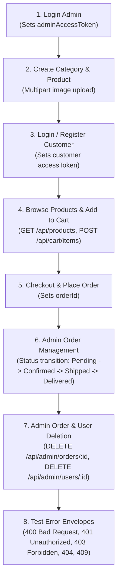

# 📮 NovaStore API — Postman Collection & Environment

This directory contains the complete Postman workspace files for testing and exploring the NovaStore REST API.

---

## 📁 Files Included

| File | Description |
|---|---|
| [`ecommerce.postman_collection.json`](./ecommerce.postman_collection.json) | Complete API collection with 35+ requests across 8 folders, pre-configured headers, query parameters, multipart forms, and post-response test scripts. |
| [`ecommerce.postman_environment.json`](./ecommerce.postman_environment.json) | Environment file containing `baseUrl`, dynamic auth tokens (`accessToken`, `adminAccessToken`), and resource IDs (`productId`, `categoryId`, `orderId`, `userId`). |

---

## 🚀 Quick Start & Import Instructions

### Step 1: Import into Postman
1. Launch **Postman** (Desktop App or Web).
2. Click the **Import** button (top-left corner).
3. Drag and drop or browse to select both files:
   - `backend/postman/ecommerce.postman_collection.json`
   - `backend/postman/ecommerce.postman_environment.json`
4. Confirm the import. You will see:
   - Collection: **E-Commerce REST API**
   - Environment: **NovaStore E-Commerce — Local Environment**

### Step 2: Select the Environment
- In the top-right environment selector dropdown of Postman, select:
  `NovaStore E-Commerce — Local Environment`.

---

## 🔑 Default Credentials

Make sure your backend server is running (`npm run dev` on port `5000`) and the database is seeded (`npm run seed`).

| Role | Email | Password |
|---|---|---|
| **Admin** | `admin@ecommerce.dev` | `Admin@Password123` |
| **Customer** | `alice@example.com` | `Customer@Password123` |

---

## ⚡ Automated Token Management

The collection is configured with **Postman Test Scripts** that automatically capture tokens and IDs upon successful execution, saving them to **both** your active Environment and Collection variables:

- **Admin Login (`POST /api/auth/login`)**: Captures `adminAccessToken` and sets it for all protected admin routes (`/api/admin/*`, `/api/categories`, `/api/products`).
- **Customer Login / Register (`POST /api/auth/login` / `register`)**: Captures `accessToken` and `refreshToken` for customer routes (`/api/cart/*`, `/api/orders/*`, `/api/users/me`).
- **Token Refresh (`POST /api/auth/refresh`)**: Rotates and updates `accessToken` and `refreshToken` automatically.
- **Resource Creation (`POST /api/categories`, `POST /api/products`, `POST /api/orders`)**: Automatically captures generated MongoDB `_id` into `categoryId`, `productId`, and `orderId` for immediate downstream testing!

---

## 📋 Recommended Testing Workflow

---

## 📂 Collection Folder Structure

1. **1. Authentication**
   - `POST /api/auth/register` — Register customer
   - `POST /api/auth/login` — Customer login
   - `POST /api/auth/login` — Admin login (auto-stores `adminAccessToken`)
   - `POST /api/auth/refresh` — Token rotation
   - `GET /api/auth/me` — Authenticated user check
   - `POST /api/auth/google` — Google OAuth payload
   - `POST /api/auth/logout` — Revoke current device token
   - `POST /api/auth/logout-all` — Revoke all device tokens
2. **2. Users Profile**
   - `GET /api/users/me` — Customer profile
   - `PATCH /api/users/me` — Update name, phone, or avatar upload
3. **3. Categories**
   - `GET /api/categories` — Public active categories
   - `GET /api/categories/:id` — Single category
   - `POST /api/categories` — Admin create with multipart image
   - `PATCH /api/categories/:id` — Admin update
   - `DELETE /api/categories/:id` — Admin delete
4. **4. Products**
   - `GET /api/products` — Pagination, search, price & stock filters
   - `GET /api/products/:id` — Product detail
   - `POST /api/products` — Admin create with up to 5 images
   - `PATCH /api/products/:id` — Admin update
   - `DELETE /api/products/:id` — Admin delete
5. **5. Cart**
   - `GET /api/cart` — User's active shopping cart
   - `POST /api/cart/items` — Add or increment item
   - `PATCH /api/cart/items/:productId` — Update item quantity
   - `DELETE /api/cart/items/:productId` — Remove specific item
   - `DELETE /api/cart` — Clear entire cart
6. **6. Orders**
   - `POST /api/orders` — Checkout cart to order
   - `GET /api/orders` — Customer's order history
   - `GET /api/orders/:id` — Order detail with tracking timeline
7. **7. Admin Management**
   - `GET /api/admin/stats/overview` — Aggregated KPI metrics
   - `GET /api/admin/dashboard/stats` — Dashboard KPI stats alias
   - `GET /api/admin/orders` — Filtered & paginated order list
   - `GET /api/admin/orders/:id` — Single order detail
   - `PATCH /api/admin/orders/:id/status` — Status transition
   - `DELETE /api/admin/orders/:id` — Delete order record
   - `GET /api/admin/users` — User accounts list
   - `GET /api/admin/users/:id` — User details
   - `GET /api/admin/users/:id/orders` — Orders placed by user
   - `PATCH /api/admin/users/:id/status` — Deactivate / activate user
   - `DELETE /api/admin/users/:id` — Delete user account
8. **8. Documented Error Responses**
   - `400 / 422 Bad Request` (Joi validation failure)
   - `401 Unauthorized` (Missing or expired JWT)
   - `403 Forbidden` (Customer trying to access Admin route)
   - `404 Not Found` (Non-existent product/order ID)
   - `409 Conflict` (Deleting category with active products attached)
